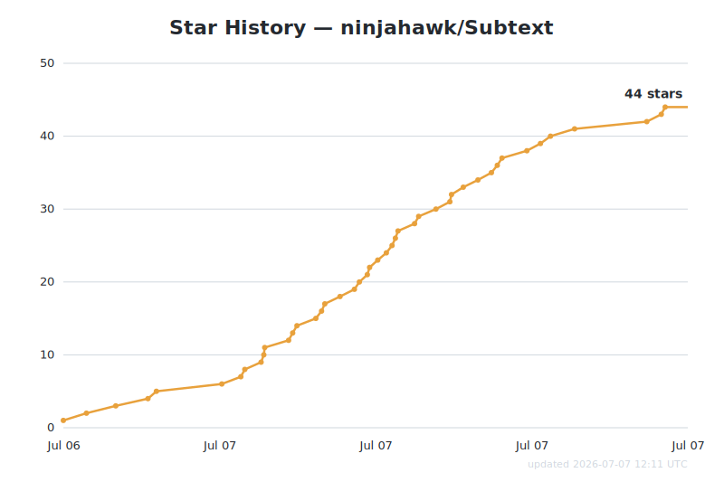
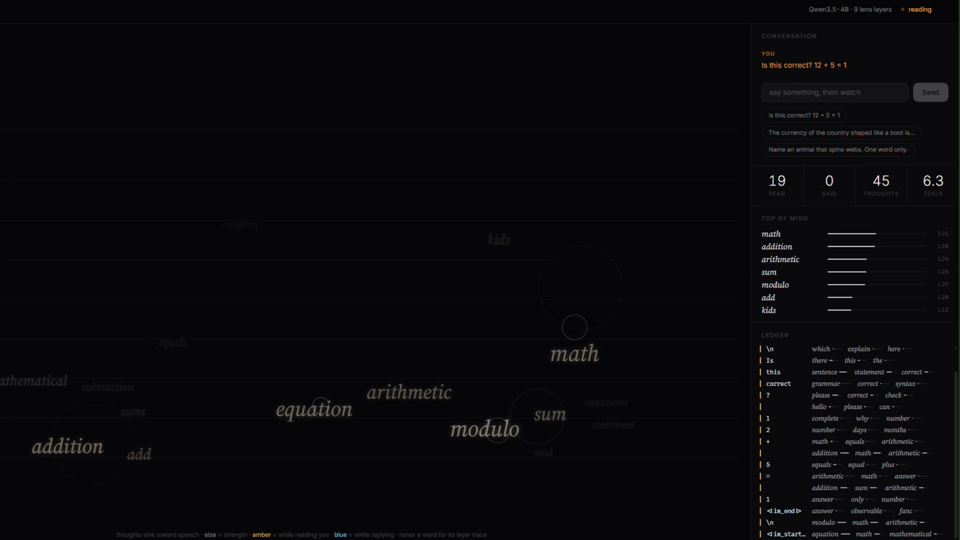
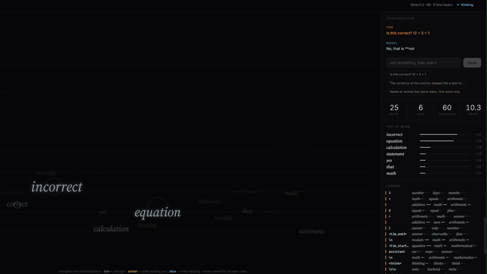
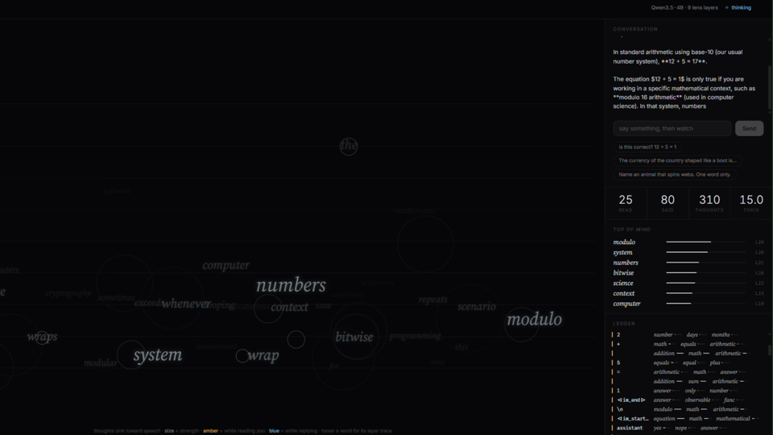

<div align="center">

# Subtext

*A real-time instrument for observing the verbal workspace of a language model<br>as it reads, reasons, and speaks.*


[](https://www.python.org/)
[](https://pytorch.org/)
[](https://huggingface.co/Qwen/Qwen3.5-4B)
[](https://huggingface.co/neuronpedia/jacobian-lens)
[](LICENSE)

**[🌐 Watch a live replay in your browser](https://ninjahawk.github.io/Subtext/)** · **[▶ Demo video](media/demo.mp4)** · **[📄 The paper](https://transformer-circuits.pub/2026/workspace/index.html)** · **[🔬 Reference implementation](https://github.com/anthropics/jacobian-lens)**

</div>

---

## Getting started & staying tuned with us.

Star us, and you will receive all release notifications from GitHub without any delay!

<a href="https://github.com/ninjahawk/Subtext/stargazers">
 <picture>
   <!-- Chart is regenerated daily by .github/workflows/star-history.yml -->
   <source media="(prefers-color-scheme: dark)" srcset="media/star-history-dark.svg" />
   <source media="(prefers-color-scheme: light)" srcset="media/star-history.svg" />
   
 </picture>
</a>

---

## Overview

Recent work from Anthropic identified a small set of internal representations in
language models — the *J-space* — that behaves like a global workspace: its
contents can be verbally reported by the model, deliberately modulated, and are
causally used for multi-step reasoning, while the surrounding majority of neural
activity remains inaccessible to report. The identification tool is the
Jacobian lens, which transports a residual-stream activation at any layer into
the final-layer basis and decodes it through the model's own unembedding,
answering: *which vocabulary words is this internal state disposed to produce,
now or later?*

Subtext applies that method continuously during live conversation with a local
model. On every token — both while the model ingests the user's message and
while it generates its reply — the lens is read at nine depths and the result
is rendered as it happens. The intermediate steps of the model's computation
become directly watchable: verdicts form during reading, several tokens before
any output; planned words hold at high strength while unrelated tokens are
being emitted; two-hop questions surface their unspoken middle term.

Subtext differs from the interactive readouts already available (e.g. the
Neuronpedia demo) in that it is conversational and continuous: it renders the
lens during a live chat, includes the reading phase over the user's message,
streams at generation speed via a KV cache, and pairs the canvas with a
per-token ledger and per-word inspector. Sessions can be exported and replayed
in any browser without a GPU.

## What the lens shows that the output does not

The value of the instrument is the gap between the model's internal state and
its visible text. Three moments from the demo session:

**1. The verdict precedes the reply.** Zero tokens of output exist; the model
is still reading `Is this correct? 12 + 5 = 1`. The workspace already holds
*math*, *addition*, *arithmetic*, *modulo* — the phase indicator is amber
(reading).



**2. The judgment is formed, then verbalized.** As the reply begins ("No, that
is **not…"), *incorrect* dominates the workspace at high strength, with
*equation*, *calculation*, *statement* co-active — the conclusion is
internally settled several tokens before the words "not correct" appear.



**3. Plans are held while other words are being said.** Mid-explanation, the
workspace holds *modulo*, *bitwise*, *system*, *numbers* — the technical
caveat the model is about to raise — while the current output token is
unrelated.



These reproduce, on an open 4B model on consumer hardware, the reporting and
planning phenomena described in the paper (which used Claude-scale models),
including the two-hop signature: *Italy* at layer 20 and *euros* at layer 26
on the country-shaped-like-a-boot question, before generation begins.

## Reading the display

- **Each rendered word is a lens readout, not model output.** It indicates an
  internal activation disposing the model toward that word.
- **Vertical position corresponds to layer.** Early layers (perception) are at
  the top; readouts approach the bottom rail as they approach emission.
- **Size and opacity encode absolute readout strength.** The display applies a
  fixed monotone mapping from lens probability; weak readouts are rendered
  weak. Amber marks readouts taken while reading the user; blue while
  generating.
- **Hover** shows a word's per-layer activation profile; **click** opens an
  inspector with peak strength, mean depth, and strength history.
- The right panel records everything the canvas curates: the conversation, a
  live ranking of currently-active readouts, and a per-token ledger.

## Timeline, words, and trace

Live playback is fast; nothing is lost. Every frame of the current response is
kept, so the whole display can be paused and re-inspected.

- **Scrub the response.** A transport bar under the canvas (step / play /
  scrubber / speed) seeks to any token; the canvas, top-of-mind ranking,
  partial reply, and stats reconstruct to that exact moment. Click any ledger
  row to jump to it. During generation the view rides the live edge — scrub
  back freely, then hit **live** to catch up. Replays are scrubbable the same
  way.
- **The words tab** (beside the ledger) aggregates every word the lens read
  out during the response — how many tokens it was active, its peak layer and
  strength — ranked by presence. Click a word to jump to its peak moment and
  load it in the trace view.
- **The trace view** (cloud / trace, top left) plots one word's readout
  strength across layers × tokens: the x-axis is shared with the scrubber,
  amber while reading, blue while generating. It shows a concept climbing the
  stack — and igniting across it just before being spoken — structure the
  instantaneous cloud cannot show. Click anywhere on it to seek.

## Method

```
browser (single HTML file)  ⇐ websocket ⇐  server.py
    Qwen3.5-4B (bf16, HF transformers, KV cache)
    pre-fitted Jacobian lens: neuronpedia/jacobian-lens, revision qwen-n1000
    per token: residual hooks at 9 layers → J_l transport → unembed
             → full-vocabulary softmax → word-start top-k → frame
```

Each exchange has two phases. A single prefill pass covers the user's message,
with lens readouts taken at every position (the *reading* phase); generation
then proceeds token-by-token with a KV cache, reading the lens at the newest
position each step (the *thinking* phase). The lens adds a per-layer
matrix-vector product and an unembedding per token, so streaming runs at the
model's native generation speed.

**Display filtering.** Raw lens top-k contains punctuation and BPE
continuation fragments (e.g. *itude*, from *cert‑itude*), which are not
meaningful as readouts. Display is restricted to word-initial vocabulary
tokens, following the reference implementation's `mask_display` with a
stricter word-start criterion. Probabilities are computed over the full
vocabulary before any filtering, so filtering affects legibility only, never
the readout itself.

## Validation

`verify_accuracy.py` compares this implementation's live path (forward hooks,
KV cache enabled) against the reference `JacobianLens.apply()` on identical
inputs. Across 4 layers × 3 positions on the walkthrough prompt, top-5
readouts match exactly, with cosine similarity ≥ 0.99998 between logit
vectors, and reproduce the expected two-hop intermediates. The audit can be
re-run at any time with the server stopped.

## Setup

Requirements: an NVIDIA GPU with ~10 GB of VRAM (and a CUDA build of PyTorch),
or an Apple Silicon Mac with 16 GB+ unified memory (PyTorch ≥ 2.3, macOS 14+;
runs on the `mps` device), plus Python 3.11+. Without either, the server falls
back to CPU (slow, but usable for smoke tests). The device is picked
automatically at startup. First launch downloads the model and lens (~9 GB
total) and builds a display-token mask (~1 minute, cached).

```bash
git clone https://github.com/ninjahawk/Subtext
cd Subtext
pip install -r requirements.txt
python server.py
# → http://localhost:8765
```

On Windows, run `python -u -X utf8 server.py`, or use `start.bat`.

**Other models.** The server is configured for Qwen3.5-4B because Neuronpedia
publishes a pre-fitted lens for it (a 27B lens is also published, for larger
GPUs — edit `MODEL_NAME`/`LENS_FILE` in `server.py`). Any HuggingFace decoder
can be used by fitting your own lens with `jlens.fit()`; ~100 prompts produces
a usable lens, and fitting a 4B-scale model takes on the order of an hour on a
single consumer GPU. See the [reference repo](https://github.com/anthropics/jacobian-lens)
for details.

**Replays.** The ⤓ session button exports the current conversation — every
lens frame included — as a JSON file. Open the app with `?replay=<file-url>`
to play one back with live pacing, no GPU required; that is exactly what the
[hosted demo](https://ninjahawk.github.io/Subtext/) is.

## Limitations

The instrument inherits the method's limitations. The lens reads only concepts
that correspond to single vocabulary tokens; multi-token concepts are invisible
or fragmentary. It approximately captures the workspace identified in the
paper, not the entirety of the model's internal state, and layers below the
fitted range are not observed. Interpretation should also respect the paper's
own framing: workspace readouts demonstrate functional availability of
information for report and reasoning; they do not demonstrate subjective
experience.

## Acknowledgements

The method and reference implementation are by Anthropic
([jacobian-lens](https://github.com/anthropics/jacobian-lens), Apache 2.0).
Pre-fitted lens weights are published by
[Neuronpedia](https://huggingface.co/neuronpedia/jacobian-lens). The model is
[Qwen3.5-4B](https://huggingface.co/Qwen/Qwen3.5-4B). Subtext is an
independent project and is not affiliated with Anthropic.

Licensed under Apache 2.0.
